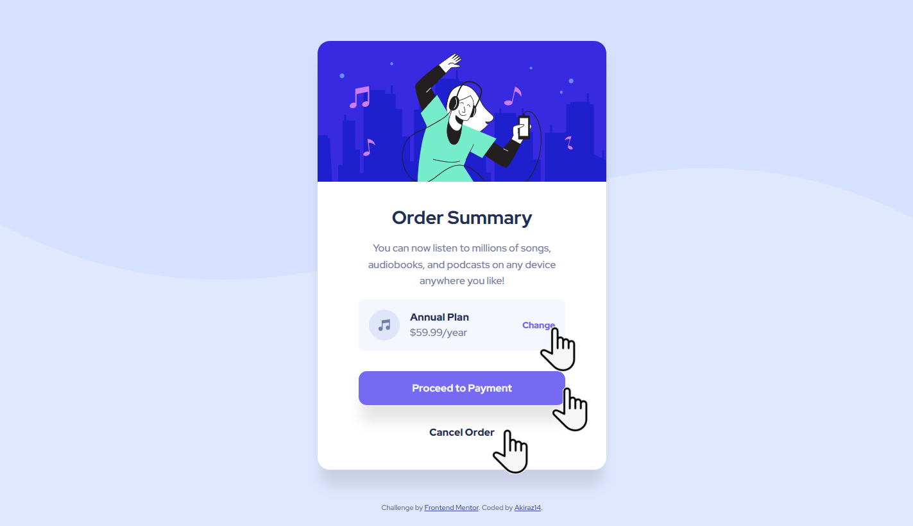

# Frontend Mentor - Order summary card solution

This is a solution to the [Order summary card challenge on Frontend Mentor](https://www.frontendmentor.io/challenges/order-summary-component-QlPmajDUj). Frontend Mentor challenges help you improve your coding skills by building realistic projects. 

## Table of contents

- [Overview](#overview)
  - [The challenge](#the-challenge)
  - [Screenshot](#screenshot)
  - [Links](#links)
- [My process](#my-process)
  - [Built with](#built-with)
  - [What I learned](#what-i-learned)
  - [Useful resources](#useful-resources)
- [Author](#author)

## Overview

### The challenge

Users should be able to:

- See hover states for interactive elements

### Screenshot

### Links

- Solution URL: [Frontend Mentor](https://www.frontendmentor.io/solutions/qr-code-component-flexbox-bem-iTLvsQOljy)
- Live Site URL: [GitHub Page](https://akiraz14.github.io/order-summary-component/)

## My process

### Built with

- Semantic HTML5 markup
- CSS custom properties
- Flexbox
- Responsive Desing

### What I learned

It was an opportunity to practice HTML, CSS, OOCSS and BEM and use CSS variables.

### Useful resources

- [W3Schools](https://www.w3schools.com/) - I love this website!!! I highly recommend it.
- [Box Shadow Generator](https://box-shadow.dev/)
- [CSS Generator](https://cssgenerator.org/)

## Author

- Website - [Akiraz14](https://akiraz14.github.io/)
- Frontend Mentor - [@Akiraz14](https://www.frontendmentor.io/profile/Akiraz14)
